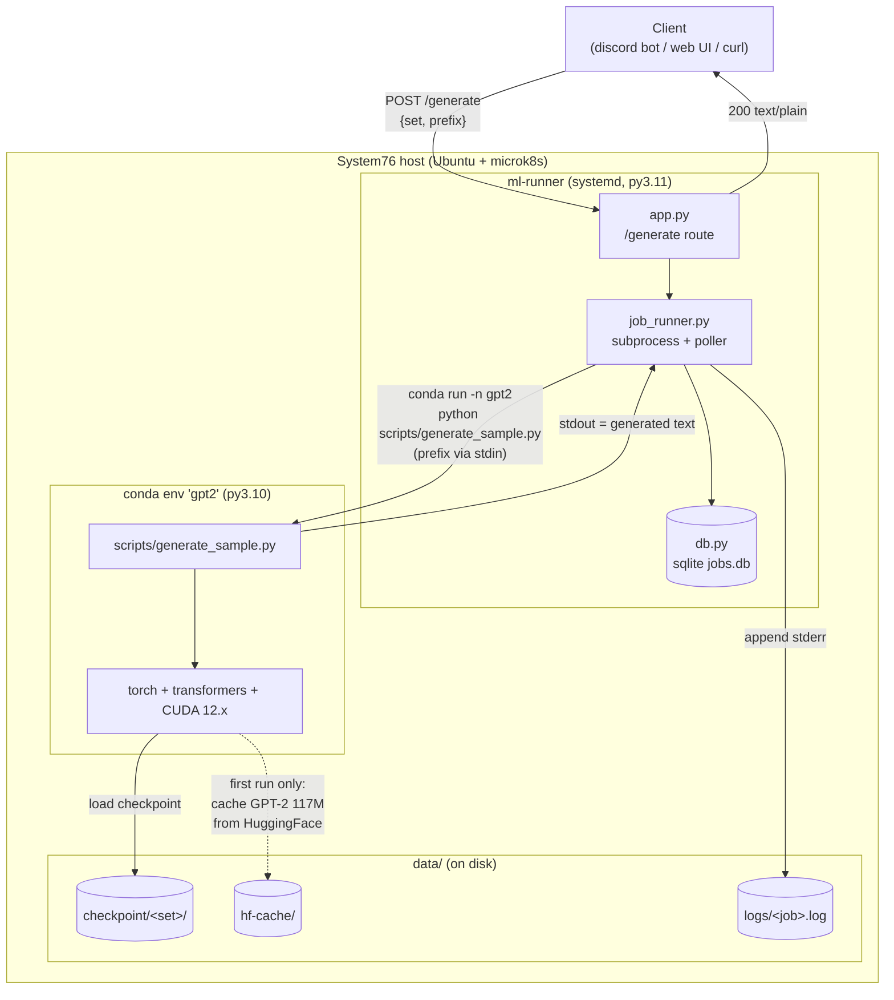
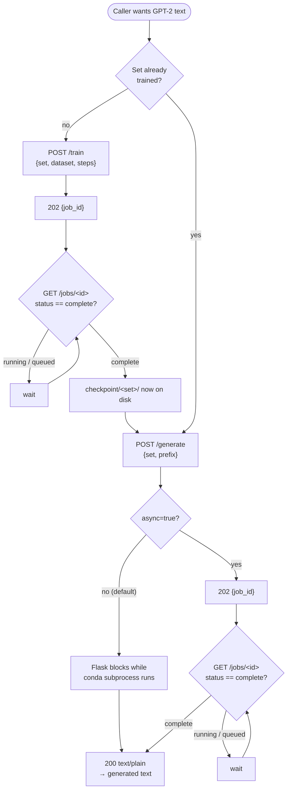
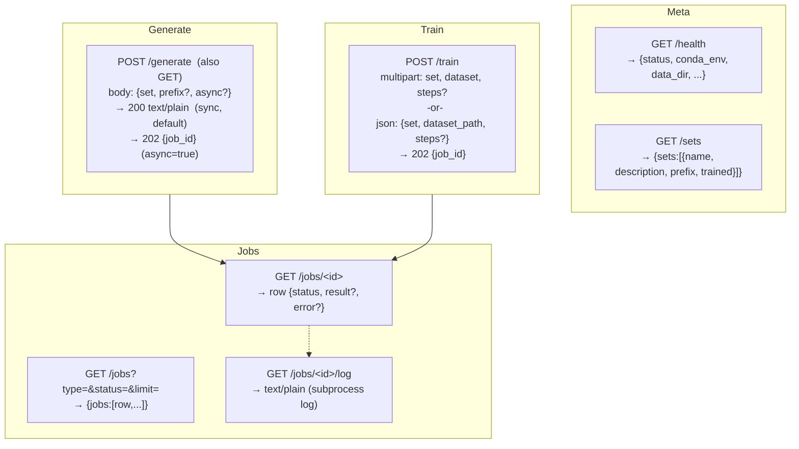

# discord_gptbot

GPT-2 generation + training service, revived. GPT-2 (the 117M model) has a
certain child-like charm — this project keeps that alive.

## What's here

- **`ml-runner/`** — the product. A Flask webservice that fronts the legacy
  GPT-2 scripts running in a separate conda env on the host. Exposes HTTP
  endpoints for generating text from a trained set and for training new sets.
  No Discord, no Docker, no k8s — just a service on the box that anything
  (a Discord bot, a web UI, whatever) can talk to over HTTP. See
  [`ml-runner/README.md`](ml-runner/README.md) for full setup + API docs.

- **`legacy/`** — the original project this revived from. Python 3.6 /
  TensorFlow 1.14 / `gpt_2_simple`, hard-wired to a single Discord server.
  Kept as a reference; not used at runtime. The `config.json` set list and the
  `generate_sample.py` / `train_set.py` scripts were ported from here into
  `ml-runner/` (with `config.json` cleaned up from a redundant dict+list shape
  into a flat array of set objects), then rewritten to use `transformers` +
  `torch` for modern GPU support (the legacy TF 1.14 stack only supported
  GPUs up to RTX 20xx).

## Quick architecture

```
client (discord bot, web UI, ...)
   │ HTTP
   ▼
ml-runner  (Flask, systemd, port 7070)
   │ subprocess: `conda run -n gpt2 python scripts/...`
   ▼
conda env "gpt2"  (python 3.10 / torch / transformers / CUDA 12.x)
   └── reads/writes data/checkpoint/<set>/ and data/hf-cache/
```

The Flask layer owns nothing ML — it just shells out to the scripts in the
ML conda env and tracks jobs in sqlite.

## Pieces involved (generate happy path)

How a single synchronous `/generate` request flows through the pieces on the
host. The Flask process, the ML conda env, the scripts, and the on-disk
model/checkpoint artifacts — and how they connect.



The same shape applies to `/train`, except `train_set.py` is invoked, it
*writes* to `checkpoint/<set>/` instead of reading, and the job is async
(`job_runner.py` spawns a poller thread that updates `jobs.db` when training
finishes).

## User flow



## API (pseudo-swagger)



| Endpoint | Method | Body / Params | Returns |
|---|---|---|---|
| `/health` | GET | — | `{status, conda_env, data_dir, config_present, ...}` |
| `/sets` | GET | — | `{sets:[{name, description, prefix, trained}]}` |
| `/generate` | GET/POST | `set`*, `prefix`?, `async`? | sync → `200 text/plain`; async → `202 {job_id}` |
| `/train` | POST | `set`*, `steps`?, `dataset` (file) *or* `dataset_path` | `202 {job_id}` |
| `/jobs` | GET | `type`?, `status`?, `limit`? | `{jobs:[row,...]}` |
| `/jobs/<id>` | GET | — | job row `{status, result?, error?, log_path, ...}` |
| `/jobs/<id>/log` | GET | — | `text/plain` subprocess log |

Job `status` is one of `queued` / `running` / `complete` / `failed`.

See [`ml-runner/README.md`](ml-runner/README.md) for setup and API details.